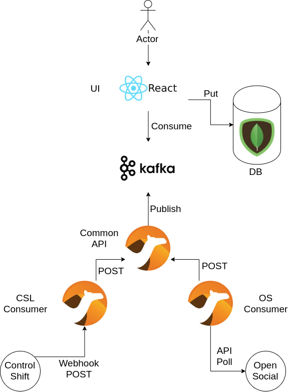

# Greenpeace Planet 4 Architecture

## Architecture Components

1. **UI** - A ReactJS Front End component
2. **Backend** - A NodeJS API for consuming data. Also handles consuming messages from Kafka and persisting them to the Database
3. **Database** - A Mongo Database for persisting event data.
4. **Kafka Topic** - Used for streaming event data from consuming apis to the backend/database.
5. **Common API** - Camel ingress interface for Event data.
6. **ControlShift Consumer** - Camel interface for consuming event data from the Control Shift Labs external service.
7. **Open Social Consumer** - Camel interface for consuming event data from the Open Social external service.
